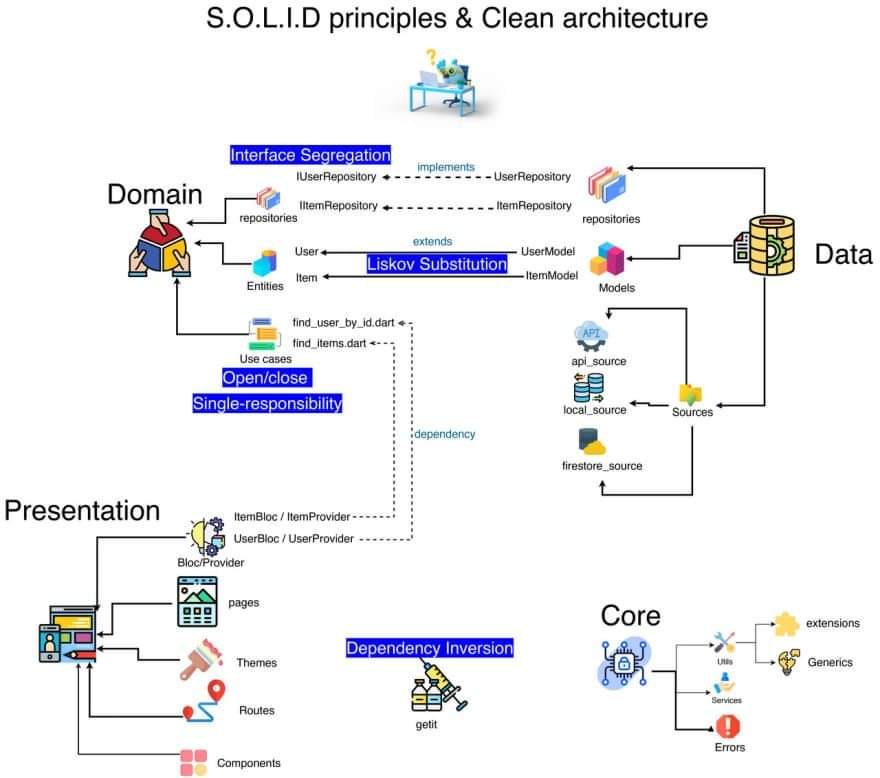

### Simple Examples to Explain SOLID Principles

Small, runnable Dart examples that show each SOLID principle with
`before` (violation) and `after` (improved) versions.



## Structure

- SRP
  - `bin/srp/before_srp.dart`
  - `bin/srp/after_srp.dart`
- OCP
  - `bin/ocp/before_ocp.dart`
  - `bin/ocp/after_ocp_interface.dart`
  - `bin/ocp/after_ocp_abstract.dart`
- LSP
  - `bin/lsp/before_lsp.dart`
  - `bin/lsp/after_lsp.dart`
- ISP
  - `bin/isp/before_isp.dart`
  - `bin/isp/after_isp.dart`
- DIP
  - `bin/dip/before_dip.dart`
  - `bin/dip/after_dip.dart`

## Run examples

```sh
dart bin/srp/before_srp.dart
dart bin/srp/after_srp.dart
dart bin/ocp/before_ocp.dart
dart bin/ocp/after_ocp_interface.dart
dart bin/ocp/after_ocp_abstract.dart
dart bin/lsp/before_lsp.dart
dart bin/lsp/after_lsp.dart
dart bin/isp/before_isp.dart
dart bin/isp/after_isp.dart
dart bin/dip/before_dip.dart
dart bin/dip/after_dip.dart
```

## Tutorial

This short tutorial explains each SOLID principle using the `before` and
`after` examples in this repo. Open each file and compare the change in
design and responsibilities.

### SRP — Single Responsibility Principle

**Idea:** A class should have one reason to change.

- **Before:** `TransferMoney` handles transfer logic, SMS notification, and
  persistence in the same class.
- **After:** `TransferMoneySRP` delegates notifications to `SmsService` and
  persistence to `TransactionsDB`, keeping each class focused.

**Why it matters:** Smaller, focused classes are easier to test, change, and
reuse without breaking unrelated behavior.

### OCP — Open/Closed Principle

**Idea:** Open for extension, closed for modification.

- **Before:** `Employee.calculateOverTime` uses a `switch` on `EmployeeType`.
  Adding a new employee type forces you to modify existing logic.
- **After:** Different employee types implement or extend an abstraction and
  provide their own overtime calculation.

**Why it matters:** You can add new behavior without editing existing, stable
code.

### LSP — Liskov Substitution Principle

**Idea:** Subtypes must be substitutable for their base types.

- **Before:** `UploadVideo` throws when given a non-`.mp4` file, even though it
  is used as an `UploadFileService` that should accept any file. This breaks
  substitution.
- **After:** Each uploader declares what it can handle and the client selects
  a compatible uploader.

**Why it matters:** Substitutability keeps polymorphism safe and predictable.

### ISP — Interface Segregation Principle

**Idea:** Clients should not be forced to depend on methods they do not use.

- **Before:** `IPayment` requires Apple Pay, Google Pay, and credit card
  methods for every payment type, causing empty or unsupported methods.
- **After:** Smaller interfaces (`IApplePay`, `IGooglePay`,
  `ICreditCardPayment`) let each class implement only what it supports.

**Why it matters:** Smaller interfaces reduce unused code and prevent fake
implementations.

### DIP — Dependency Inversion Principle

**Idea:** High-level modules should depend on abstractions, not concretions.

- **Before:** `Email` creates concrete services directly, tightly coupling the
  high-level class to low-level details.
- **After:** `Email` receives an `IMessage` abstraction, and concrete services
  are injected.

**Why it matters:** Abstractions make code easier to test, swap, and extend.
